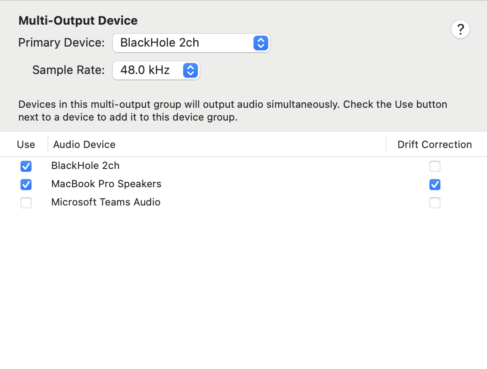
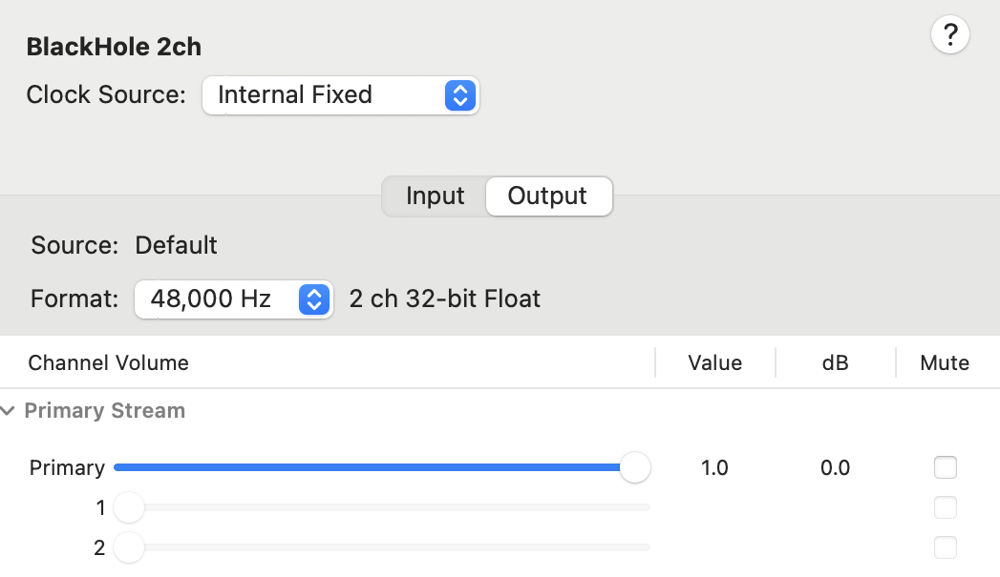
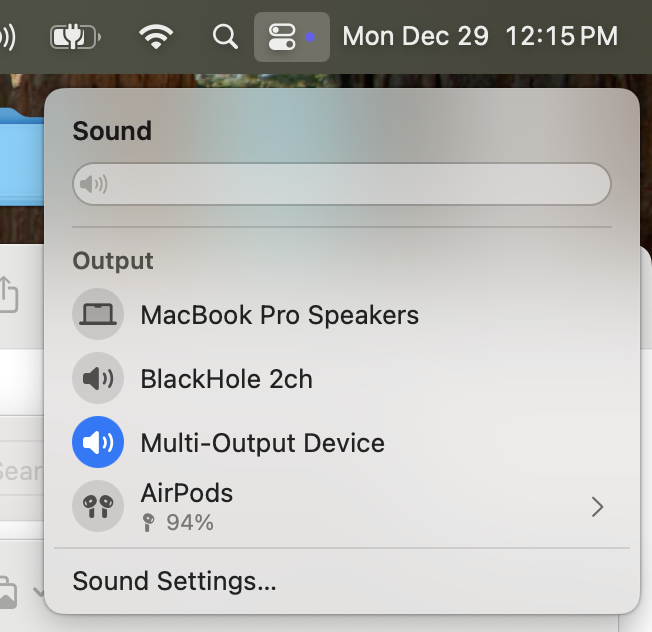

# WhisperMac

## Setting Up

Please do the following sections in order shown.

### Install Blackhole 2ch For Mac: https://existential.audio/blackhole/

- This is needed to send audio to the Python script for transcription

### Multi-Output Device in Audio MIDI

1. Click the `+` icon in the bottom left and choose the option with 'Multi-Ouput Device'
2. Configure the Multi-Output Device to look this:

3. Go to `Blackhole 2ch` in Audio MIDI, and make sure Output format is 48,000 Hz and Primary value is 1.0:

Now every time you want audio to go to both speakers and Blackhole, just change the Sound output:

NOTE: in Multi-Ouput Device output, the volume will NOT be able to be changed. You must change the volume of the speaker first before switching to Multi-Ouput Device.

### Setting Up Xcode

Install Xcode from App Store and accept Agreement

### Create Conda Environment

1. Make sure you have conda installed (https://docs.conda.io/projects/conda/en/stable/user-guide/install/index.html)
2. Run `conda env create -f transcription.yml`
3. Then activate using `conda activate whispermac`

Now run `bash setup.sh`, and then wait for the set up to be complete! 

Finally, run `python main.py` to start subtitle transcription. Note, it can take 5-10 seconds to start up on first run. Subsequent runs will be instant.

## Useful Commands

### Running real-time transcription

1. Run `conda activate whispermac` 
2. Run `python main.py` 

### Running whisper-stream binary

1. `cd` into `whisper.cpp`
2. Build binary with `cmake --build build -j --config Release`
3. Run `./build/bin/whisper-stream -m ./models/ggml-large-v3-turbo.bin -t 6 --step 1000 --length 5000 --keep 500`
    - This should use the microphone by default. If want to switch to Blackhole, look at the list of devices shown from the capture devices list and run the command with `-c <number corresponding to Blackhole>`

### Updating transcription.yml with new packages

After `pip install`, run `conda env export > transcription.yml`

### Formatting python files

Run `black *.py`
